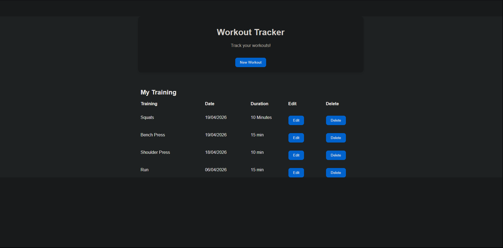
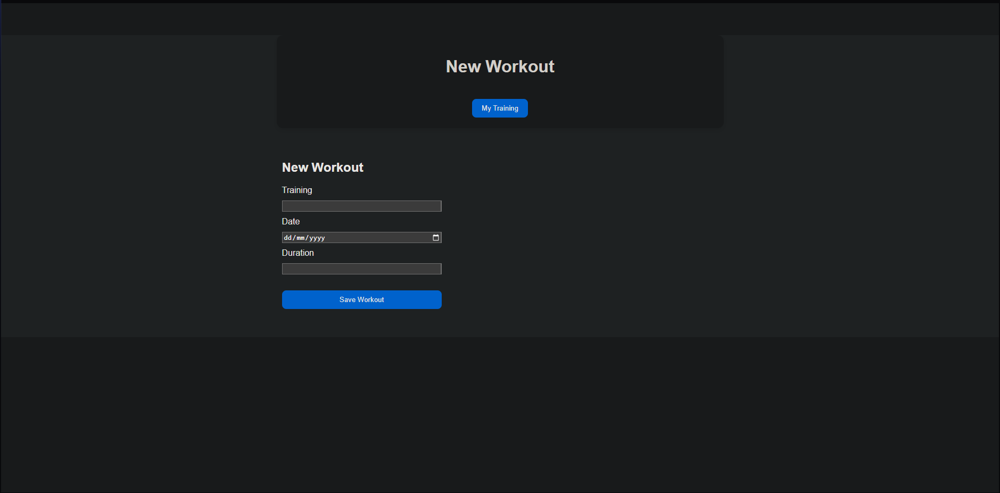

# flask_workout_tracker
Full-stack Flask workout tracker with CRUD operations, date parsing/sorting, form validation, and JSON-based storage.

## Features
- Add, edit, and delete workouts
- Automatic date sorting (newest first)
- Form validation for clean input
- Responsive design (mobile and desktop)

## Tech Used
- Python
- Falsk
- HTML
- CSS
- JSON

## Screenshot

## How to Run
1. Install requirements:
   pip install flask

3. Run:
   python main.py
